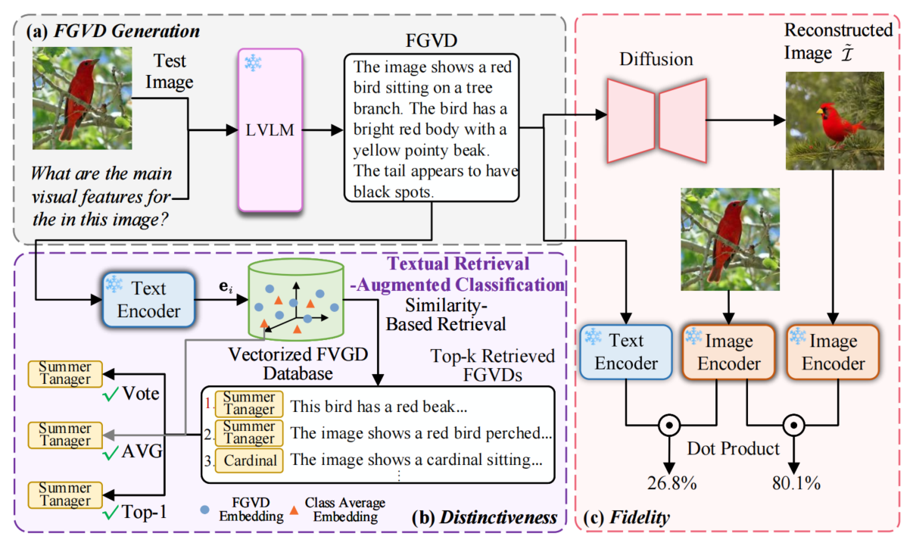

# Exploring the Distinctiveness and Fidelity of the Descriptions Generated by Large Vision-Language Models
[](https://github.com/y2l/meta-transfer-learning-tensorflow/blob/master/LICENSE)
[](https://www.python.org/)
[](https://pytorch.org/)

This repository includes the PyTorch implementation for our ACM MM 2024 paper. 

#### Summary

* [Introduction](#introduction)
* [Getting Started](#getting-started)
    - [Generating Fine-Grained Visual Description](#generation-of-visual-description)
* [Datasets](#datasets)
* [Citation](#citation)
* [Acknowledgements](#acknowledgements)


## Introduction
 Large Vision-Language Models (LVLMs) are gaining traction for their remarkable ability to process and integrate visual and textual data. Despite their popularity, the capacity of LVLMs to generate precise, fine-grained textual descriptions has not been fully explored. This study addresses this gap by focusing on \textit{distinctiveness} and \textit{fidelity}, assessing how models like Open-Flamingo, IDEFICS, and MiniGPT-4 can distinguish between similar objects and accurately describe visual features. We proposed the Textual Retrieval-Augmented Classification (TRAC) framework, which, by leveraging its generative capabilities, allows us to delve deeper into analyzing fine-grained visual description generation. This research provides valuable insights into the generation quality of LVLMs, enhancing the understanding of multimodal language models. Notably, MiniGPT-4 stands out for its better ability to generate fine-grained descriptions, outperforming the other two models in this aspect. 





> Figure: An overview of our framework for evaluating the quality of fine-grained visual descriptions (FGVDs) generated by Large Vision-Language Models (LVLMs). In the FGVD Generation phase (a), FGVDs are produced by conditioning on both visual and linguistic cues. Subsequently, we evaluate the quality of generated content in terms of its distinctiveness (b) and fidelity (c).

## Getting Started

Create a conda environment for running the generation (MiniGPT-4 and IDEFICS), run
```bash
conda create -n fgvd python=3.9
pip install -r requirements.txt
```
While for openflamingo, you have to create another conda environment `fgvd2` and set versions as `transformers==4.28.1`.


### Generating Fine-Grained Visual Description

#### IDEFICS

```bash
source /usr/local/anaconda3/bin/activate /home/XXXX/.conda/envs/fgvd
export PYTHONPATH="$PYTHONPATH:YOUR_PATH"
DEVICE_NUM=4

DATA_NAME="" # dataset name
DATA_PATH="" # dataset path

python run_gen.py \
    --dataset_name $DATA_NAME \
    --dataset_root $DATA_PATH \
    --device $DEVICE_NUM \
    --dataset_type "test" \
    --num_samples -1 \
    --describe \
    --batch_size 2 \
    --others "partlen" \
    --model_cfg "ide.yaml" \
    --max_length 60 \
    --shots 0 \
```

#### openflamingo

```bash
source /usr/local/anaconda3/bin/activate /home/XXXX/.conda/envs/fgvd2
export PYTHONPATH="$PYTHONPATH:YOUR_PATH"
DEVICE=4

DATA_NAME="" # dataset name
DATA_PATH="" # dataset path

python run_gen.py \
    --model $MODEL \
    --model_cfg "of9b.yaml" \
    --device $DEVICE \
    --shots 0 \
    --dataset_type "train" \
    --dataset_name $DATA_NAME \
    --dataset_root $DATA_PATH \
    --batch_size 20 \
    --describe \
    --max_length 60 \
    --others "partlen" \
```
#### MiniGPT-4

```bash
source /usr/local/anaconda3/bin/activate /home/XXXX/.conda/envs/fgvd
export PYTHONPATH="$PYTHONPATH:YOUR_PATH"
DEVICE=4

DATA_NAME="" # dataset name
DATA_PATH="" # dataset path

python generate_description/eval/description_minigpt4.py \
    --dataset_name $DATA_NAME \
    --dataset_root $DATA_PATH \
    --device $DEVICE \
    --cfg_path "eval_config.yaml" \
    --dataset_type 'test' \
    --others "alllen" \
    --max_new_tokens 60
```

## Datasets
[ImageNet](https://www.image-net.org/download.php),  [CUB-200](http://www.vision.caltech.edu/datasets/cub_200_2011/), [Stanford Dogs](http://vision.stanford.edu/aditya86/ImageNetDogs/) and  [Stanford Cars](https://www.kaggle.com/datasets/jessicali9530/stanford-cars-dataset) are chosen for evaluation.


## Citation

Please cite our paper if it is helpful to your work:


## TODO
Working on it...

## Acknowledgements

Our implementations is built upon the source code from [OpenFlamingo](https://github.com/mlfoundations/open_flamingo/tree/main).
